# Diagramas de Flujo - ClawAndSoul Backend

Este documento describe los flujos de trabajo principales del backend de ClawAndSoul, una plataforma de generación de contenido AI para mascotas con generaciones **gratuitas e ilimitadas** para todos los usuarios.

## Tabla de Contenidos

- [Pipeline de Request/Response](#pipeline-de-requestresponse)
- [Flujo de Autenticación](#flujo-de-autenticación)
- [Flujo de Generación de Contenido AI](#flujo-de-generación-de-contenido-ai)
- [Arquitectura de Módulos](#arquitectura-de-módulos)
- [Sistema de Guards y Decoradores](#sistema-de-guards-y-decoradores)
- [Tabla de Endpoints](#tabla-de-endpoints)

---

## Pipeline de Request/Response

Cada petición HTTP que llega al backend pasa por el siguiente pipeline en orden:

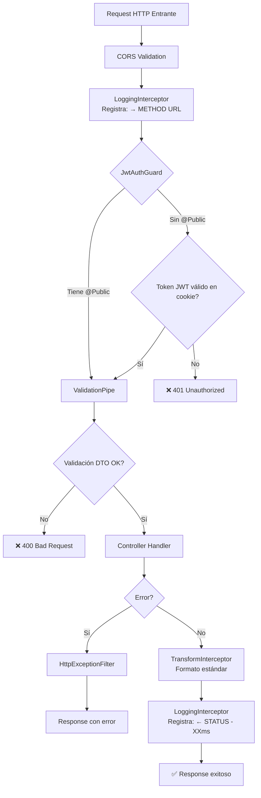

### Componentes del Pipeline

1. **CORS Validation** ([main.ts:44](src/main.ts#L44))
   - Valida origen del request
   - Permite credenciales
   - Por defecto: `http://localhost:3000`

2. **LoggingInterceptor** ([logging.interceptor.ts](src/common/interceptors/logging.interceptor.ts))
   - Registra request entrante: `→ METHOD URL`
   - Registra response saliente: `← METHOD URL STATUS - XXms`
   - Calcula tiempo de respuesta

3. **JwtAuthGuard** ([jwt-auth.guard.ts](src/common/guards/jwt-auth.guard.ts))
   - Aplicado globalmente (todos los endpoints requieren auth)
   - Excepción: endpoints con decorador `@Public()`
   - Lee el token JWT desde la cookie httpOnly `accessToken`

4. **ValidationPipe** ([main.ts:25](src/main.ts#L25))
   - Valida DTOs automáticamente usando `class-validator`
   - `whitelist: true` - Elimina propiedades no definidas
   - `transform: true` - Transforma tipos automáticamente
   - `enableImplicitConversion: true` - Conversión de tipos primitivos

5. **TransformInterceptor** ([transform.interceptor.ts](src/common/interceptors/transform.interceptor.ts))
   - Envuelve todas las respuestas exitosas en formato estándar:
   ```json
   {
     "success": true,
     "data": { ... },
     "timestamp": "2026-01-23T10:00:00.000Z"
   }
   ```

6. **HttpExceptionFilter** ([http-exception.filter.ts](src/common/filters/http-exception.filter.ts))
   - Captura y formatea errores consistentemente
   - Maneja excepciones HTTP de NestJS

---

## Flujo de Autenticación

Los tokens JWT se almacenan como **cookies httpOnly** (nunca en el body de respuesta). Esto previene ataques XSS.

- **Access Token**: cookie `accessToken`, vida útil 15 minutos
- **Refresh Token**: cookie `refreshToken`, vida útil 7 días, almacenado en base de datos

### Registro de Usuario

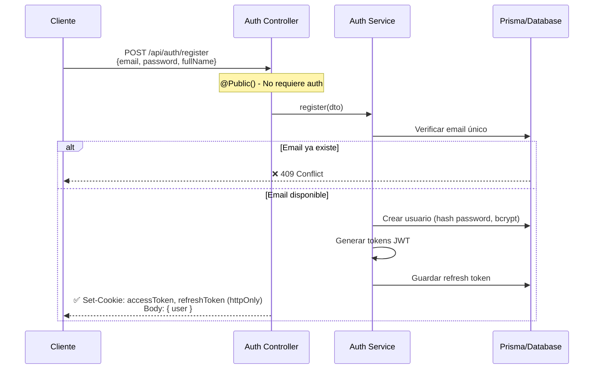

### Login

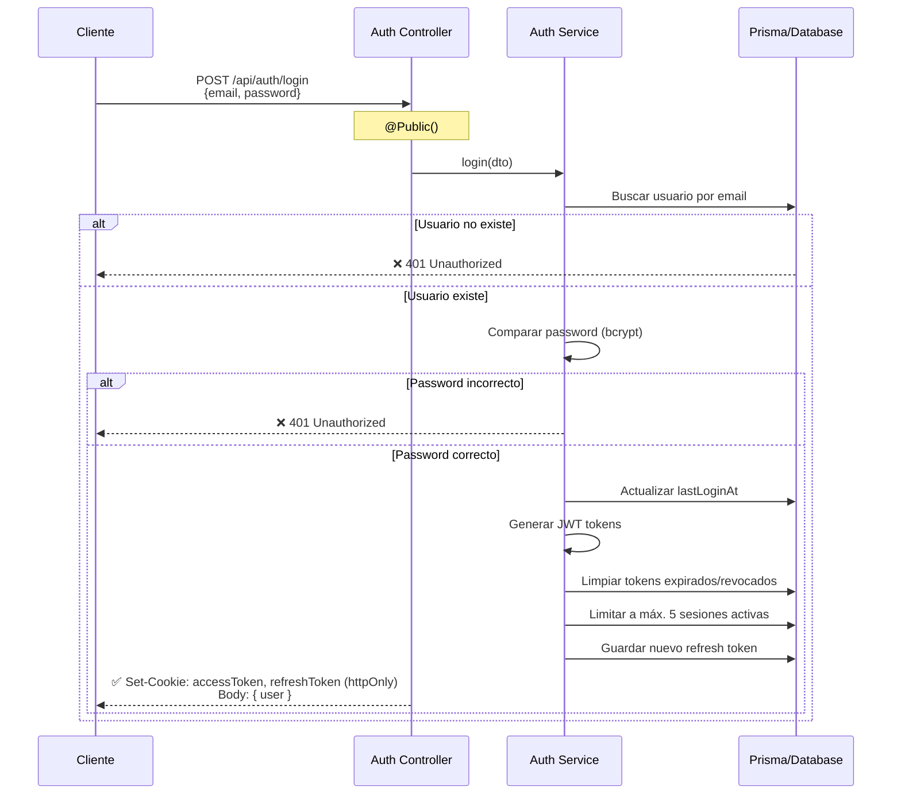

### Refresh Token (con Rotación)

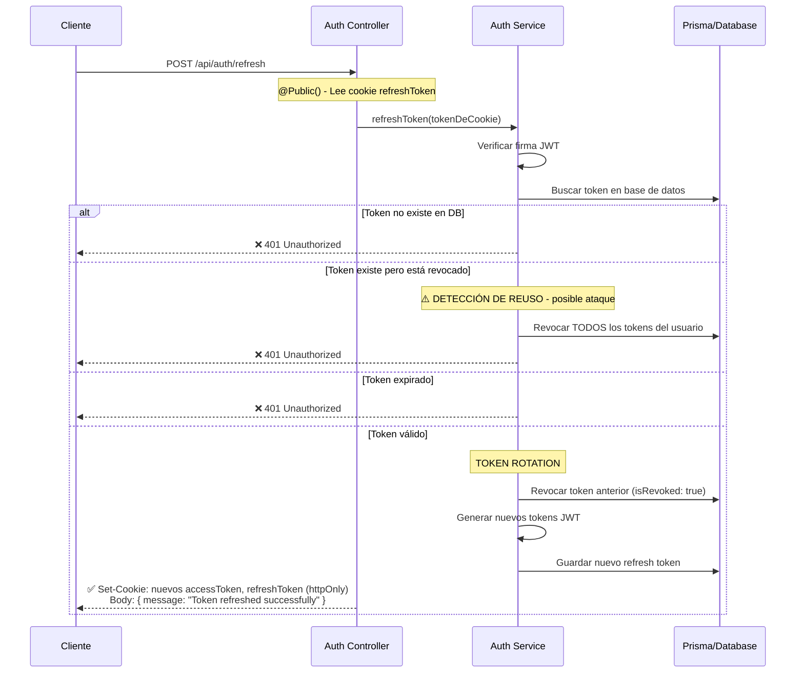

### Logout

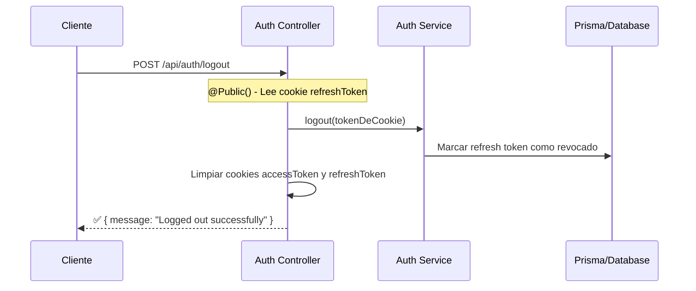

### Gestión de Sesiones

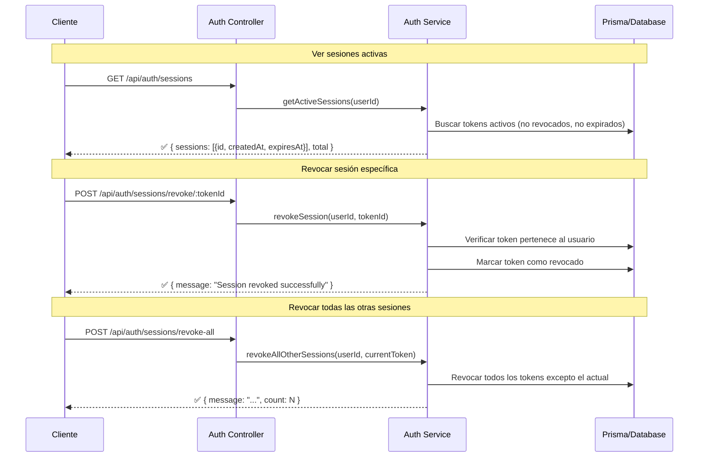

### Protección de Endpoints

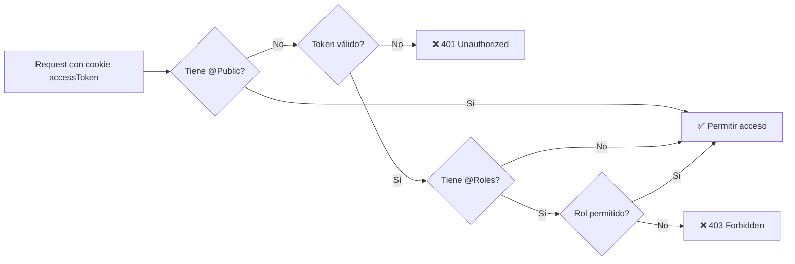

---

## Flujo de Generación de Contenido AI

Todas las generaciones son **gratuitas e ilimitadas**. No hay verificación ni deducción de créditos.

### Flujo de Generación de Imagen

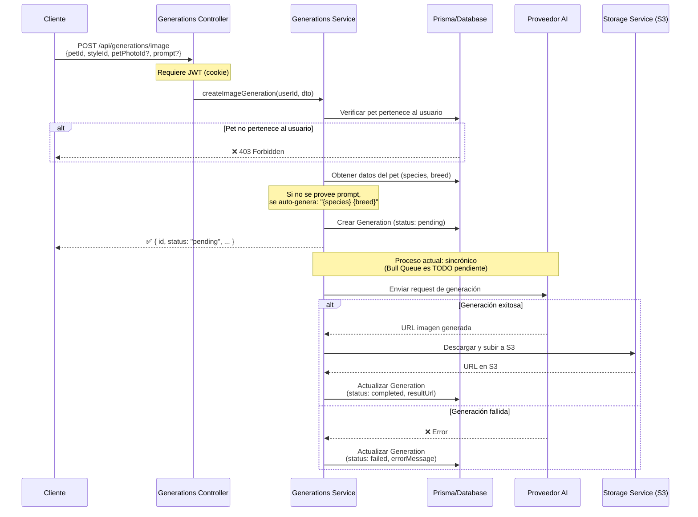

### Flujo de Generación de Video

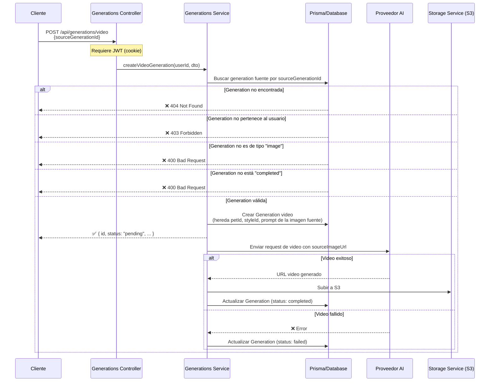

### Estados de una Generación

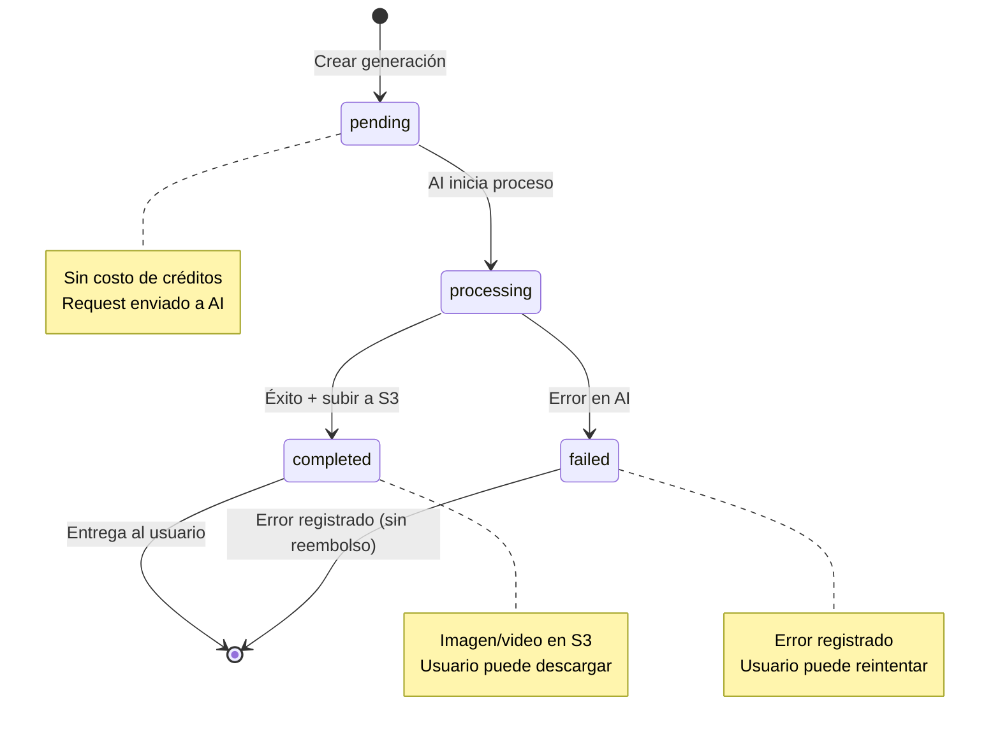

### Consulta de Generaciones

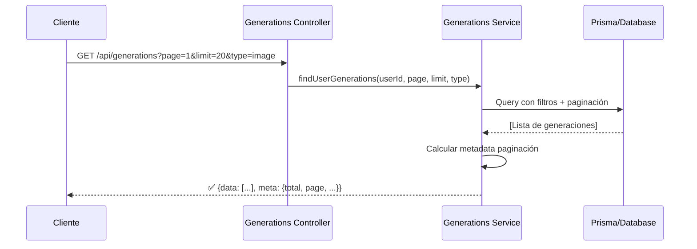

---

## Arquitectura de Módulos

Estructura modular basada en dominios (Domain-Driven Design).

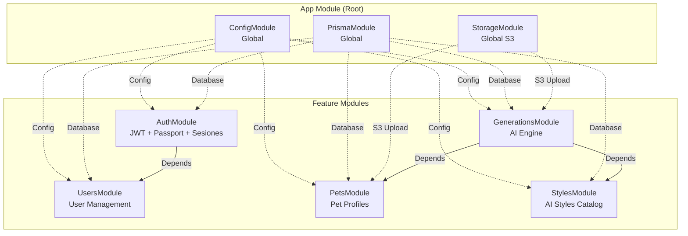

### Responsabilidades de Cada Módulo

| Módulo | Responsabilidad | Endpoints Principales |
|--------|----------------|---------------------|
| **AuthModule** | Autenticación, JWT, cookies, sesiones | `/api/auth/login`<br/>`/api/auth/register`<br/>`/api/auth/refresh`<br/>`/api/auth/logout`<br/>`/api/auth/sessions` |
| **UsersModule** | Gestión de perfil de usuario | `/api/users/me` |
| **PetsModule** | Perfiles de mascotas, fotos | `/api/pets`<br/>`/api/pets/:id` |
| **StylesModule** | Catálogo de estilos AI | `/api/styles`<br/>`/api/styles/:id` |
| **GenerationsModule** | Motor de generación AI (gratis) | `/api/generations/image`<br/>`/api/generations/video` |
| **StorageModule** | Upload/download S3 (global) | Usado internamente |
| **PrismaModule** | Acceso a base de datos (global) | Usado internamente |

---

## Sistema de Guards y Decoradores

NestJS utiliza Guards para proteger endpoints. Este backend implementa autenticación y autorización basada en roles.

### Jerarquía de Guards

```mermaid
graph TD
    A[Request] --> B[JwtAuthGuard<br/>Global - Todos los endpoints]
    B -->|@Public| Z[✅ Bypass - Endpoint público]
    B -->|Sin @Public| C[Leer cookie accessToken]
    C -->|Token inválido/ausente| Z1[❌ 401 Unauthorized]
    C -->|Token válido| D{RolesGuard<br/>¿Tiene @Roles?}
    D -->|No| W[✅ Continuar]
    D -->|Sí| E{Rol coincide?}
    E -->|No| Z2[❌ 403 Forbidden]
    E -->|Sí| W
    W --> H[Controller Handler]
```

### Decoradores Disponibles

#### 1. `@Public()`
Permite acceso sin autenticación.

```typescript
@Public()
@Post('login')
async login(@Body() dto: LoginDto) {
  // No requiere JWT token
}
```

**Usado en:**
- `POST /api/auth/login`
- `POST /api/auth/register`
- `POST /api/auth/refresh`
- `POST /api/auth/logout`
- `GET /api/styles` y sub-rutas

#### 2. `@Roles(...roles)`
Restringe acceso a roles específicos.

```typescript
@Roles('admin')
@Delete('users/:id')
async deleteUser(@Param('id') id: string) {
  // Solo admin puede ejecutar
}
```

**Roles disponibles:**
- `user` - Usuario estándar
- `premium` - Usuario con suscripción
- `admin` - Administrador del sistema

#### 3. `@CurrentUser()`
Inyecta el usuario autenticado en el handler.

```typescript
@Get('me')
async getProfile(@CurrentUser() user: User) {
  // user contiene: { sub: userId, email, role }
}
```

### Flujo de Ejecución de Guards

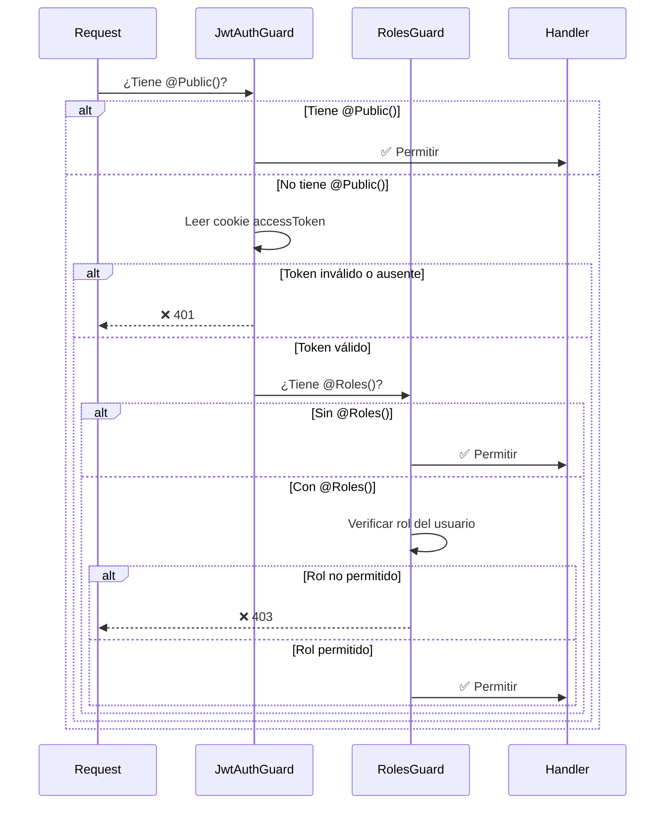

---

## Tabla de Endpoints

Todos los endpoints están prefijados con `/api`.

### Auth (`/api/auth`)

| Método | Ruta | Auth | Descripción |
|--------|------|------|-------------|
| `POST` | `/auth/register` | Público | Registrar nuevo usuario. Retorna cookies + user |
| `POST` | `/auth/login` | Público | Login. Retorna cookies + user |
| `POST` | `/auth/refresh` | Público | Rotar tokens usando cookie refreshToken |
| `POST` | `/auth/logout` | Público | Revocar refresh token y limpiar cookies |
| `GET` | `/auth/me` | JWT | Obtener usuario actual del JWT |
| `GET` | `/auth/sessions` | JWT | Listar sesiones activas del usuario |
| `POST` | `/auth/sessions/revoke/:tokenId` | JWT | Revocar sesión específica por ID |
| `POST` | `/auth/sessions/revoke-all` | JWT | Revocar todas las sesiones excepto la actual |

### Users (`/api/users`)

| Método | Ruta | Auth | Descripción |
|--------|------|------|-------------|
| `GET` | `/users/me` | JWT | Obtener perfil completo del usuario actual |
| `PATCH` | `/users/me` | JWT | Actualizar perfil del usuario actual |

### Pets (`/api/pets`)

| Método | Ruta | Auth | Descripción |
|--------|------|------|-------------|
| `POST` | `/pets` | JWT | Crear nuevo perfil de mascota |
| `GET` | `/pets` | JWT | Listar todas las mascotas del usuario |
| `GET` | `/pets/:id` | JWT | Obtener mascota por ID |
| `PATCH` | `/pets/:id` | JWT | Actualizar mascota |
| `DELETE` | `/pets/:id` | JWT | Eliminar mascota (soft delete) |

### Styles (`/api/styles`)

| Método | Ruta | Auth | Descripción |
|--------|------|------|-------------|
| `GET` | `/styles` | Público | Listar todos los estilos activos |
| `GET` | `/styles/categories` | Público | Listar categorías disponibles |
| `GET` | `/styles/category/:category` | Público | Estilos por categoría |
| `GET` | `/styles/:id` | Público | Obtener estilo por ID |

### Generations (`/api/generations`)

| Método | Ruta | Auth | Descripción |
|--------|------|------|-------------|
| `POST` | `/generations/image` | JWT | Crear generación de imagen (gratis) |
| `POST` | `/generations/video` | JWT | Crear generación de video desde imagen completada |
| `GET` | `/generations` | JWT | Listar generaciones del usuario (paginado) |
| `GET` | `/generations/:id` | JWT | Obtener generación por ID |
| `DELETE` | `/generations/:id` | JWT | Eliminar generación |

---

## Notas Importantes

### Modelo Gratuito e Ilimitado

Todas las generaciones de imágenes y videos son completamente **gratuitas e ilimitadas** para todos los usuarios. No existe sistema de créditos. El rol de usuario (`user`, `premium`, `admin`) se mantiene para diferenciación futura de funcionalidades.

### Seguridad de Sesiones

- Máximo **5 sesiones activas** por usuario (las más antiguas se revocan automáticamente)
- **Rotación de refresh tokens**: cada uso del refresh endpoint genera un nuevo par de tokens
- **Detección de reuso**: si un refresh token revocado es utilizado, se revocan **todos** los tokens del usuario como medida de seguridad
- **Limpieza automática**: tokens expirados y revocados se eliminan de la DB en cada login/refresh

### Auto-generación de Prompts

Si no se proporciona un `prompt` al crear una generación de imagen, el sistema lo genera automáticamente usando los datos de la mascota:

```
prompt = "{species} {breed}"
// Ejemplo: "dog labrador"
```

### Estado Actual de la Generación Asíncrona

Actualmente la generación AI es **sincrónica** - el endpoint espera a que el proveedor AI responda antes de retornar. La implementación con **Bull Queue** para procesamiento asíncrono real es un TODO pendiente.

### Cascadas de Eliminación

El esquema de base de datos usa cascadas para mantener integridad referencial:

- Eliminar `User` → elimina en cascada `pets`, `generations`, `refreshTokens`
- Eliminar `Pet` → elimina en cascada `photos`, `generations`
- Eliminar `Style` → **NO** elimina generaciones (usa `SetNull`)

### Seguridad General

- Tokens JWT en cookies httpOnly (protección XSS)
- `sameSite: 'lax'` (protección CSRF, compatible con OAuth)
- `secure: true` solo en producción (requiere HTTPS)
- Passwords hasheados con bcrypt (salt rounds: 12)
- Validación estricta de DTOs con whitelist
- CORS configurado para `FRONTEND_URL` específico

---

## Referencias de Código

- [main.ts](src/main.ts) - Configuración global de la aplicación
- [app.module.ts](src/app.module.ts) - Módulo raíz y configuración de guards
- [auth.controller.ts](src/auth/auth.controller.ts) - Endpoints de autenticación y sesiones
- [auth.service.ts](src/auth/auth.service.ts) - Lógica de tokens, rotación, sesiones
- [jwt-auth.guard.ts](src/common/guards/jwt-auth.guard.ts) - Guard de autenticación
- [logging.interceptor.ts](src/common/interceptors/logging.interceptor.ts) - Logging de requests
- [transform.interceptor.ts](src/common/interceptors/transform.interceptor.ts) - Formato de respuestas
- [generations.controller.ts](src/generations/generations.controller.ts) - Endpoints de generación
- [generations.service.ts](src/generations/generations.service.ts) - Lógica de generación AI

---

## Swagger Documentation

Toda la API está documentada en Swagger UI:

**URL:** `http://localhost:3001/api/docs`

Incluye:
- Todos los endpoints
- DTOs y validaciones
- Códigos de respuesta
- Ejemplos de requests/responses
- Autenticación Bearer JWT
