# Diagramas de Flujo - ClawAndSoul Backend

Este documento describe los flujos de trabajo principales del backend de ClawAndSoul, una plataforma de generación de contenido AI para mascotas.

## Tabla de Contenidos

- [Pipeline de Request/Response](#pipeline-de-requestresponse)
- [Flujo de Autenticación](#flujo-de-autenticación)
- [Flujo de Generación de Contenido AI](#flujo-de-generación-de-contenido-ai)
- [Flujo de Compra de Créditos (Shopify)](#flujo-de-compra-de-créditos-shopify)
- [Arquitectura de Módulos](#arquitectura-de-módulos)
- [Sistema de Guards y Decoradores](#sistema-de-guards-y-decoradores)

---

## Pipeline de Request/Response

Cada petición HTTP que llega al backend pasa por el siguiente pipeline en orden:

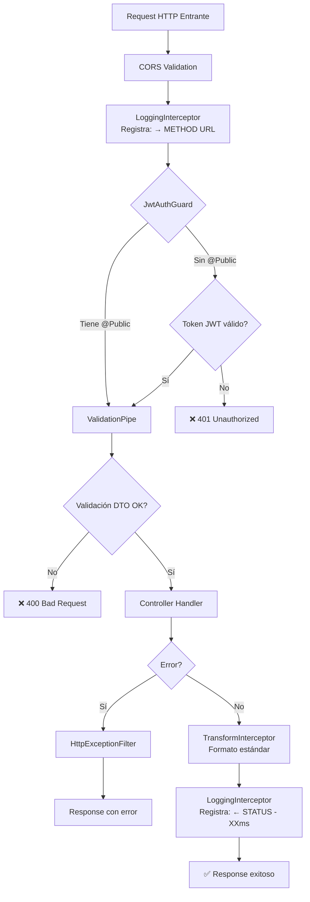

### Componentes del Pipeline

1. **CORS Validation** ([main.ts:44](src/main.ts#L44))
   - Valida origen del request
   - Permite credenciales
   - Por defecto: `http://localhost:3000`

2. **LoggingInterceptor** ([logging.interceptor.ts](src/common/interceptors/logging.interceptor.ts))
   - Registra request entrante: `→ METHOD URL`
   - Registra response saliente: `← METHOD URL STATUS - XXms`
   - Calcula tiempo de respuesta

3. **JwtAuthGuard** ([jwt-auth.guard.ts](src/common/guards/jwt-auth.guard.ts))
   - Aplicado globalmente (todos los endpoints requieren auth)
   - Excepción: endpoints con decorador `@Public()`
   - Valida token JWT en header `Authorization: Bearer <token>`

4. **ValidationPipe** ([main.ts:25](src/main.ts#L25))
   - Valida DTOs automáticamente usando `class-validator`
   - `whitelist: true` - Elimina propiedades no definidas
   - `transform: true` - Transforma tipos automáticamente
   - `enableImplicitConversion: true` - Conversión de tipos primitivos

5. **TransformInterceptor** ([transform.interceptor.ts](src/common/interceptors/transform.interceptor.ts))
   - Envuelve todas las respuestas exitosas en formato estándar:
   ```json
   {
     "success": true,
     "data": { ... },
     "timestamp": "2026-01-23T10:00:00.000Z"
   }
   ```

6. **HttpExceptionFilter** ([http-exception.filter.ts](src/common/filters/http-exception.filter.ts))
   - Captura y formatea errores consistentemente
   - Maneja excepciones HTTP de NestJS

---

## Flujo de Autenticación

### Registro de Usuario

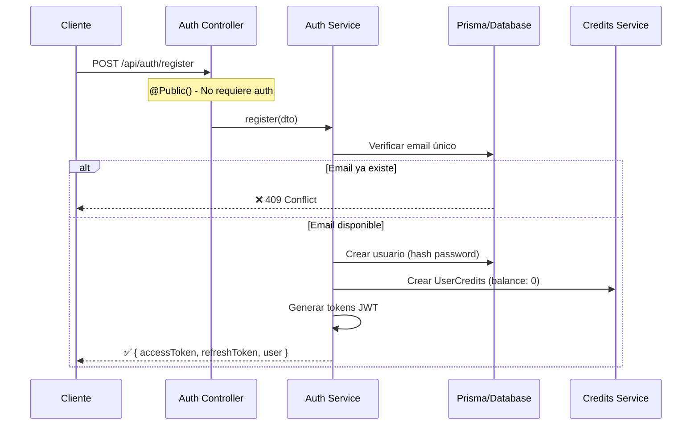

### Login

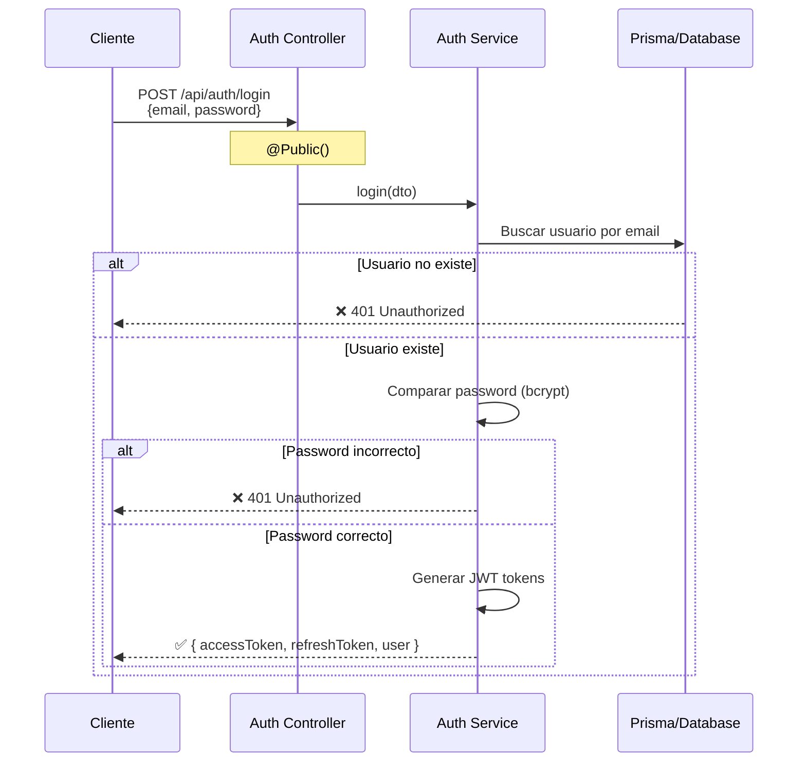

### Refresh Token

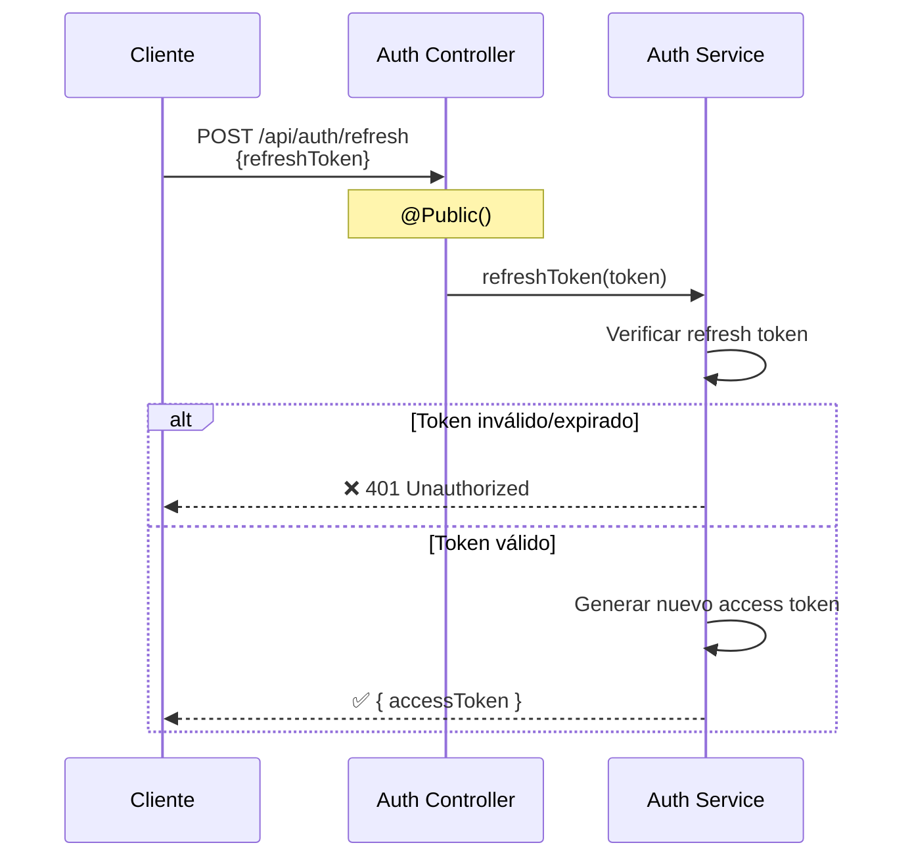

### Protección de Endpoints

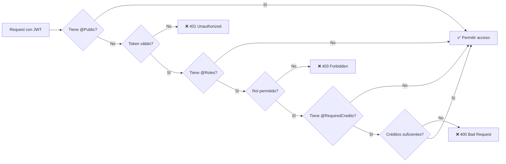

---

## Flujo de Generación de Contenido AI

Este es el flujo más complejo del sistema, manejando generaciones de imágenes y videos con IA.

### Flujo Completo de Generación

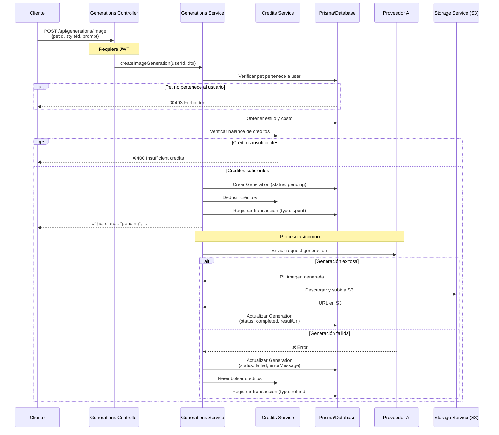

### Estados de una Generación

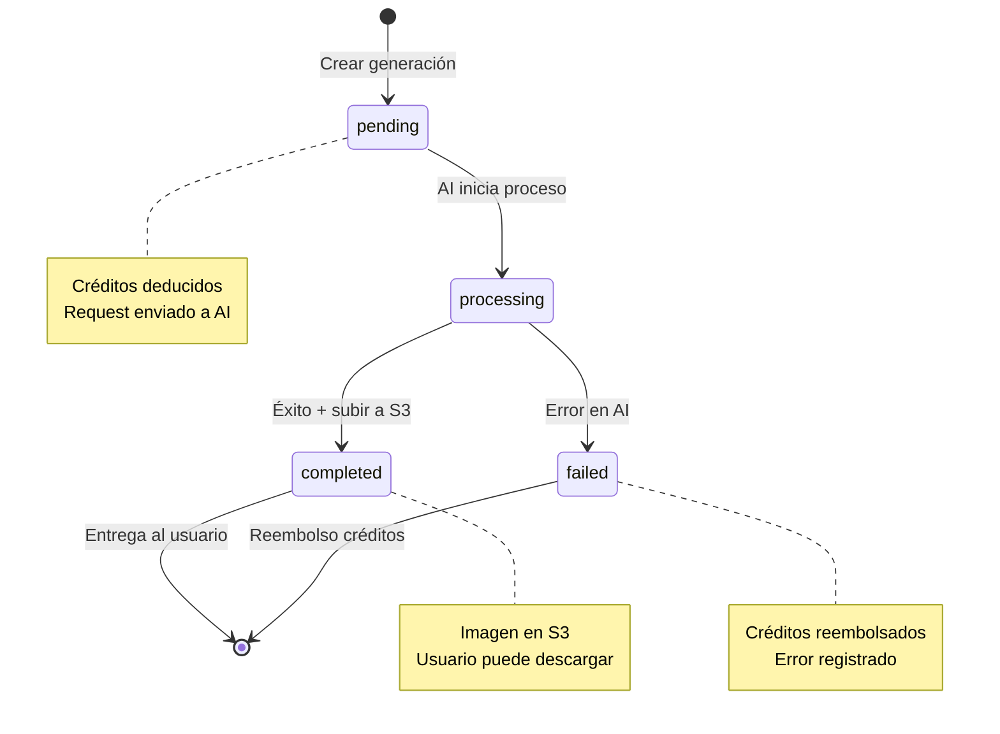

### Consulta de Generaciones

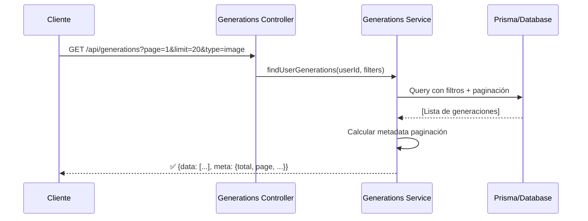

---

## Flujo de Compra de Créditos (Shopify)

Integración con Shopify para compra de paquetes de créditos.

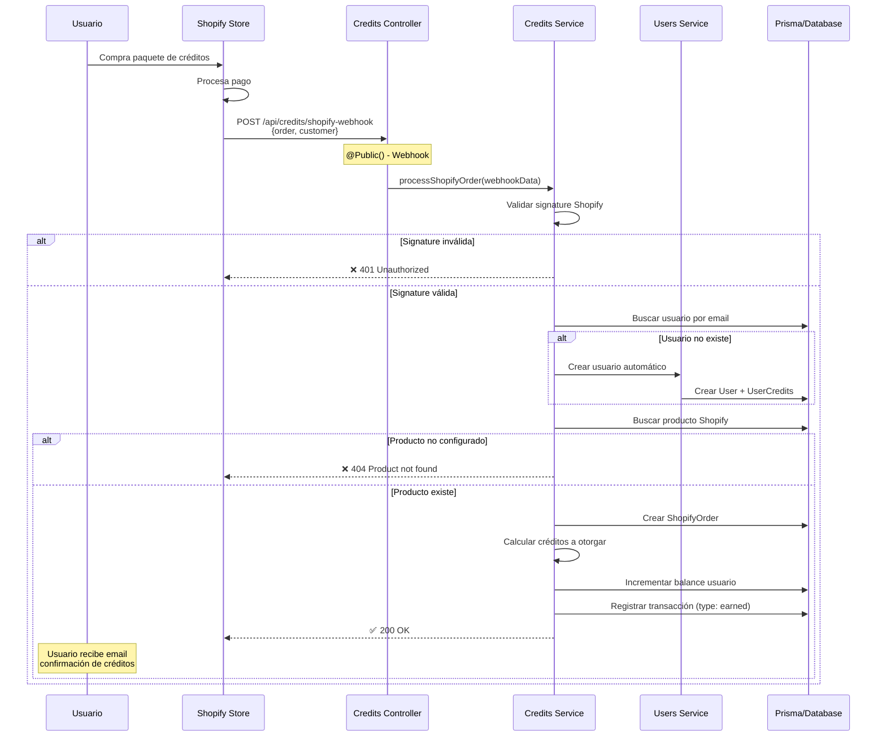

### Tipos de Transacciones de Créditos

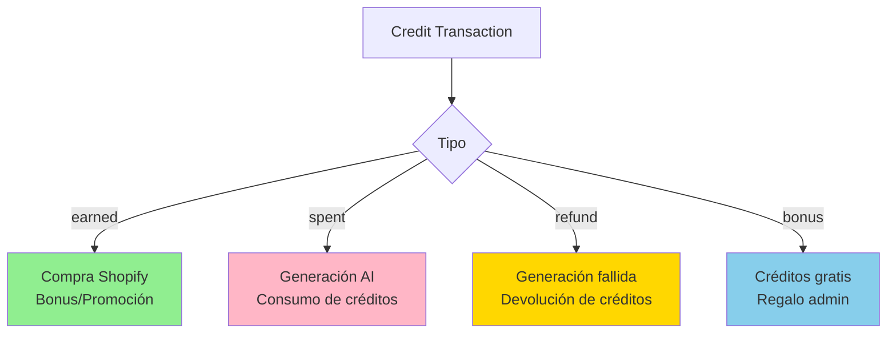

---

## Arquitectura de Módulos

Estructura modular basada en dominios (Domain-Driven Design).

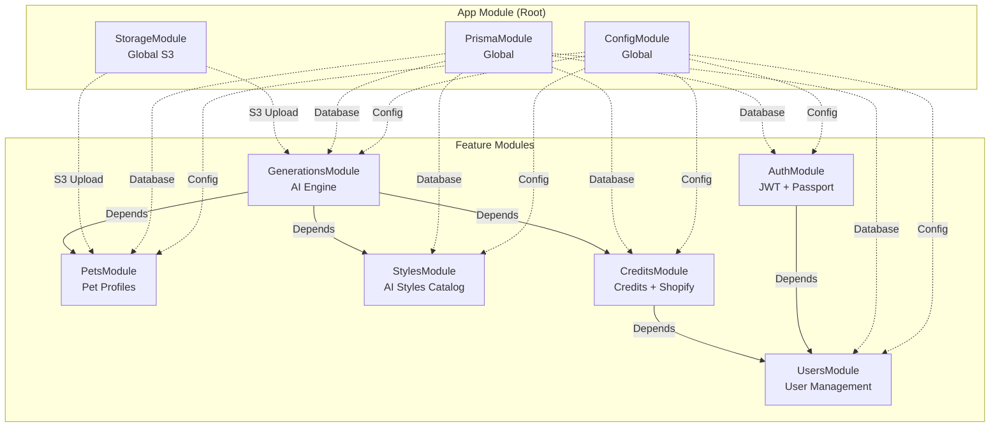

### Responsabilidades de Cada Módulo

| Módulo | Responsabilidad | Endpoints Principales |
|--------|----------------|---------------------|
| **AuthModule** | Autenticación, JWT, login/register | `/api/auth/login`<br/>`/api/auth/register`<br/>`/api/auth/refresh` |
| **UsersModule** | Gestión de usuarios, perfiles | `/api/users/:id`<br/>`/api/users/profile` |
| **PetsModule** | Perfiles de mascotas, fotos | `/api/pets`<br/>`/api/pets/:id/photos` |
| **StylesModule** | Catálogo de estilos AI | `/api/styles`<br/>`/api/styles/:id` |
| **GenerationsModule** | Motor de generación AI | `/api/generations/image`<br/>`/api/generations/video` |
| **CreditsModule** | Balance, transacciones, Shopify | `/api/credits/balance`<br/>`/api/credits/shopify-webhook` |
| **StorageModule** | Upload/download S3 (global) | Usado internamente |
| **PrismaModule** | Acceso a base de datos (global) | Usado internamente |

---

## Sistema de Guards y Decoradores

NestJS utiliza Guards para proteger endpoints. Este backend implementa un sistema robusto de autorización.

### Jerarquía de Guards

```mermaid
graph TD
    A[Request] --> B[JwtAuthGuard<br/>Global - Todos los endpoints]
    B -->|@Public| Z[✅ Bypass - Endpoint público]
    B -->|Sin @Public| C[Validar JWT Token]
    C -->|Token inválido| Z1[❌ 401 Unauthorized]
    C -->|Token válido| D{RolesGuard<br/>¿Tiene @Roles?}
    D -->|No| W[✅ Continuar]
    D -->|Sí| E{Rol coincide?}
    E -->|No| Z2[❌ 403 Forbidden]
    E -->|Sí| F{RequiredCreditsGuard<br/>¿Tiene @RequiredCredits?}
    F -->|No| W
    F -->|Sí| G{Balance suficiente?}
    G -->|No| Z3[❌ 400 Bad Request]
    G -->|Sí| W
    W --> H[Controller Handler]
```

### Decoradores Disponibles

#### 1. `@Public()`
Permite acceso sin autenticación.

```typescript
@Public()
@Post('login')
async login(@Body() dto: LoginDto) {
  // No requiere JWT token
}
```

**Usado en:**
- `/api/auth/login`
- `/api/auth/register`
- `/api/auth/refresh`
- `/api/credits/shopify-webhook`

#### 2. `@Roles(...roles)`
Restringe acceso a roles específicos.

```typescript
@Roles('admin', 'premium')
@Delete('users/:id')
async deleteUser(@Param('id') id: string) {
  // Solo admin o premium pueden ejecutar
}
```

**Roles disponibles:**
- `user` - Usuario estándar
- `premium` - Usuario con suscripción
- `admin` - Administrador del sistema

#### 3. `@RequiredCredits(amount)`
Verifica balance mínimo de créditos.

```typescript
@RequiredCredits(10)
@Post('generate')
async generate(@Body() dto: CreateGenerationDto) {
  // Requiere al menos 10 créditos
}
```

#### 4. `@CurrentUser()`
Inyecta el usuario autenticado en el handler.

```typescript
@Get('profile')
async getProfile(@CurrentUser() user: User) {
  // user contiene: { sub: userId, email, role }
}
```

### Ejemplo Completo

```typescript
@Controller('admin/generations')
@ApiTags('admin')
export class AdminGenerationsController {

  // Solo admin, requiere 50 créditos
  @Post('batch')
  @Roles('admin')
  @RequiredCredits(50)
  async batchGenerate(
    @CurrentUser() user: User,
    @Body() dto: BatchGenerateDto
  ) {
    // user.role === 'admin' garantizado
    // user tiene >= 50 créditos garantizado
  }
}
```

### Flujo de Ejecución de Guards

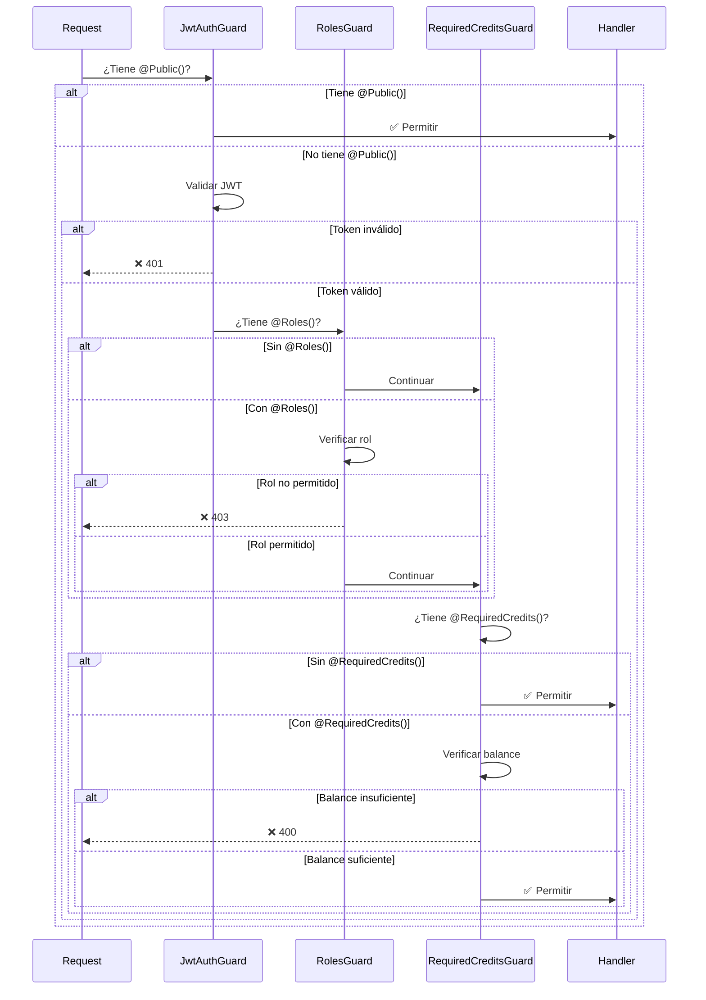

---

## Flujos de Casos de Uso Comunes

### Caso 1: Usuario Nuevo Genera su Primera Imagen

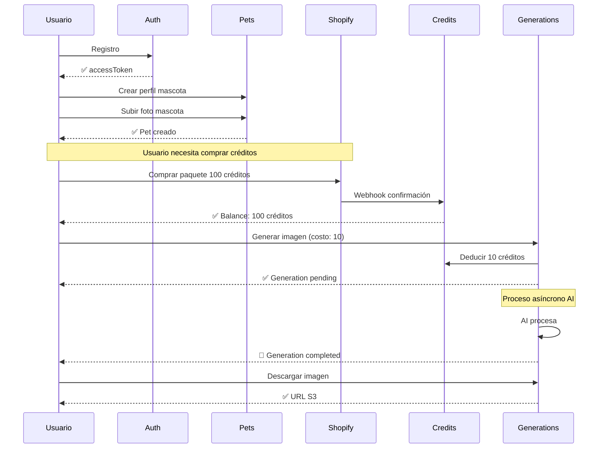

### Caso 2: Generación Fallida con Reembolso

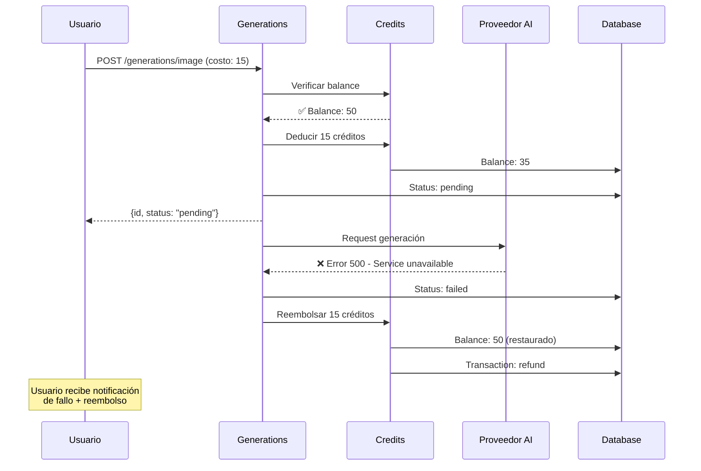

### Caso 3: Admin Otorga Créditos Bonus

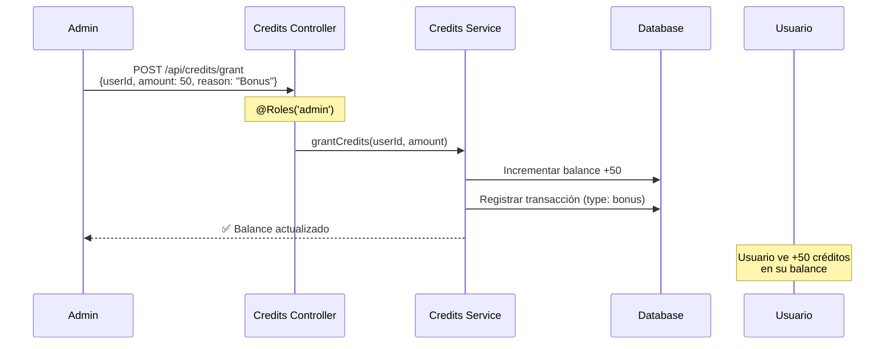

---

## Notas Importantes

### Transacciones Atómicas

Todas las operaciones de créditos usan transacciones de Prisma para garantizar consistencia:

```typescript
await prisma.$transaction([
  prisma.userCredits.update({ ... }),
  prisma.creditTransaction.create({ ... }),
  prisma.generation.create({ ... }),
]);
```

### Cascadas de Eliminación

El esquema de base de datos usa cascadas para mantener integridad referencial:

- Eliminar `User` → elimina `pets`, `credits`, `generations`
- Eliminar `Pet` → elimina `photos`, `generations`
- Eliminar `Style` → **NO** elimina generaciones (usa `SetNull`)

### Manejo Asíncrono

Las generaciones AI son procesos asíncronos:
- El endpoint retorna inmediatamente con `status: "pending"`
- El proceso AI corre en background
- Cliente debe hacer polling o usar webhooks para conocer el resultado

### Seguridad

- Tokens JWT tienen expiración configurable
- Passwords hasheados con bcrypt
- Validación estricta de DTOs
- CORS configurado para frontend específico
- Webhooks de Shopify validan signature

---

## Referencias de Código

- [main.ts](src/main.ts) - Configuración global de la aplicación
- [app.module.ts](src/app.module.ts) - Módulo raíz y configuración de guards
- [jwt-auth.guard.ts](src/common/guards/jwt-auth.guard.ts) - Guard de autenticación
- [logging.interceptor.ts](src/common/interceptors/logging.interceptor.ts) - Logging de requests
- [transform.interceptor.ts](src/common/interceptors/transform.interceptor.ts) - Formato de respuestas
- [generations.controller.ts](src/generations/generations.controller.ts) - Endpoints de generación

---

## Swagger Documentation

Toda la API está documentada en Swagger UI:

**URL:** `http://localhost:3001/api/docs`

Incluye:
- Todos los endpoints
- DTOs y validaciones
- Códigos de respuesta
- Ejemplos de requests/responses
- Autenticación Bearer JWT
